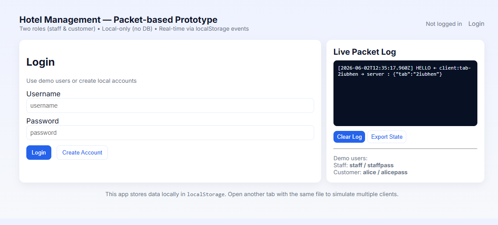
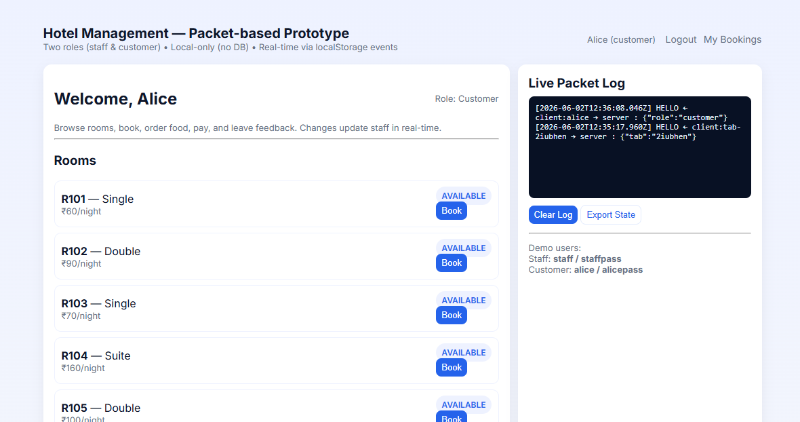

# Hotel Management System (Frontend Prototype)

### Live Website

https://tejashwinisriramula9-oss.github.io/hotel-management-system/

---

# Project Description

The Hotel Management System is a frontend-only web application built using HTML, CSS, and JavaScript. It simulates real-world hotel operations such as room booking, food ordering, payments, and feedback management without using any backend or database.

The system uses browser localStorage for data storage and a packet-based communication system to simulate real-time updates between customer and staff dashboards across multiple tabs.

---

# Objectives

1. Build a hotel management simulation system using frontend technologies.
2. Simulate real-time communication using localStorage events.
3. Enable room booking, food ordering, payments, and feedback features.
4. Provide separate dashboards for customer and staff roles.
5. Maintain persistent data using browser storage without backend.

---

# Features

## User Authentication (Demo System)

Simple login system with predefined users for staff and customers. New users can also be created and stored locally.

## Room Booking System

Customers can view available rooms, select check-in and check-out dates, and book rooms. Total price is calculated automatically based on stay duration.

## Payment System (Simulation)

Customers can simulate payments for bookings. Payment status updates instantly in the staff dashboard.

## Food Ordering System

Customers can order food from a predefined menu. Orders are tracked and managed in real time.

## Feedback System

Users can submit ratings and feedback about their experience.

## Staff Dashboard

Staff can:
- View all rooms and status
- Manage bookings
- Mark payments as completed
- Track food orders
- View customer feedback

## Real-Time Packet System

A custom packet-based system using localStorage events simulates real-time communication between multiple browser tabs.

---

# Screenshots

## Login Page
Secure login system for staff and customers.



---

## Customer Dashboard
Customers can browse rooms, book rooms, place orders, and submit feedback.



---

## Staff Dashboard
Staff can manage bookings, payments, food orders, and view feedback.


---

## Ordering & Feedback System
Customers can order food and submit feedback easily.


---

# Technical Architecture

## Frontend
- HTML5
- CSS3
- Vanilla JavaScript
- Google Fonts (Inter)

## Data Storage
- localStorage used for:
  - Users
  - Rooms
  - Bookings
  - Orders
  - Feedback

## Real-Time Simulation
- localStorage events
- Custom packet-based system
- Cross-tab communication

---

# Run Locally

Simply open the project:

```bash
index.html
